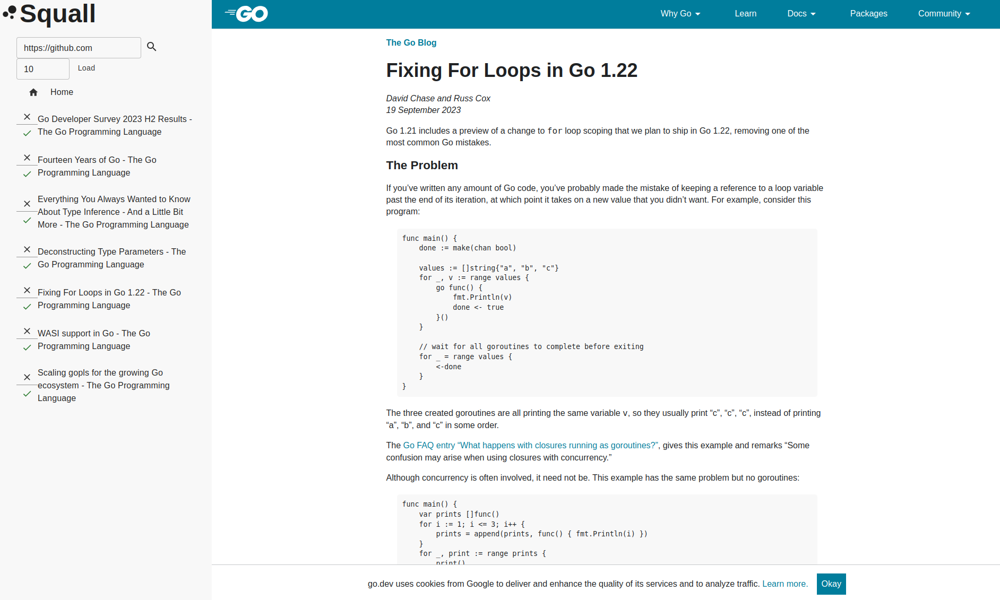

Squall is notification viewer!

## TODO

- [ ] タブが切り替わらないことがある
- [ ] 既読を押しても、次読み込んだときに表示されることがある
- [ ] 取得したエントリの一覧を出す
- [ ] フィードソースの一覧を出す
- [ ] 現在のURLを表示する
- [ ] コピペできるようにする
- [ ] サーバと表示状態を関連させる(タブの削除が成功したときだけ、削除APIをリクエストするなど)
- [ ] 統計をとる
- [ ] 統計を表示する
