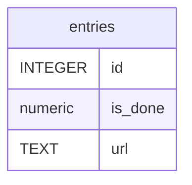

# entries

## Description

RSSなどの情報源から取得した、1つのURLを持つWebページ。  


<details>
<summary><strong>Table Definition</strong></summary>

```sql
CREATE TABLE `entries` (`id` integer PRIMARY KEY AUTOINCREMENT,`url` text NOT NULL,`is_done` numeric NOT NULL DEFAULT false)
```

</details>

## Columns

| Name | Type | Default | Nullable | Children | Parents | Comment |
| ---- | ---- | ------- | -------- | -------- | ------- | ------- |
| id | INTEGER |  | true |  |  |  |
| is_done | numeric | false | false |  |  | 既読かどうか |
| url | TEXT |  | false |  |  | エントリのURL |

## Constraints

| Name | Type | Definition |
| ---- | ---- | ---------- |
| id | PRIMARY KEY | PRIMARY KEY (id) |

## Relations



---

> Generated by [tbls](https://github.com/k1LoW/tbls)
