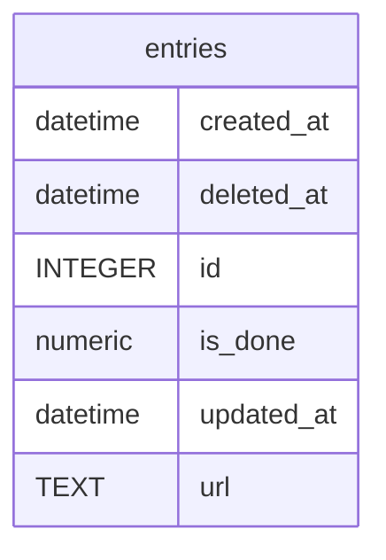

# entries

## Description

RSSなどの情報源から取得した、1つのURLを持つWebページ。  


<details>
<summary><strong>Table Definition</strong></summary>

```sql
CREATE TABLE `entries` (`id` integer PRIMARY KEY AUTOINCREMENT,`created_at` datetime,`updated_at` datetime,`deleted_at` datetime,`url` text NOT NULL UNIQUE,`is_done` numeric NOT NULL DEFAULT false)
```

</details>

## Columns

| Name | Type | Default | Nullable | Children | Parents | Comment |
| ---- | ---- | ------- | -------- | -------- | ------- | ------- |
| created_at | datetime |  | true |  |  |  |
| deleted_at | datetime |  | true |  |  |  |
| id | INTEGER |  | true |  |  |  |
| is_done | numeric | false | false |  |  | 既読かどうか |
| updated_at | datetime |  | true |  |  |  |
| url | TEXT |  | false |  |  | エントリのURL |

## Constraints

| Name | Type | Definition |
| ---- | ---- | ---------- |
| id | PRIMARY KEY | PRIMARY KEY (id) |
| sqlite_autoindex_entries_1 | UNIQUE | UNIQUE (url) |

## Indexes

| Name | Definition |
| ---- | ---------- |
| idx_entries_deleted_at | CREATE INDEX `idx_entries_deleted_at` ON `entries`(`deleted_at`) |
| sqlite_autoindex_entries_1 | UNIQUE (url) |

## Relations



---

> Generated by [tbls](https://github.com/k1LoW/tbls)
